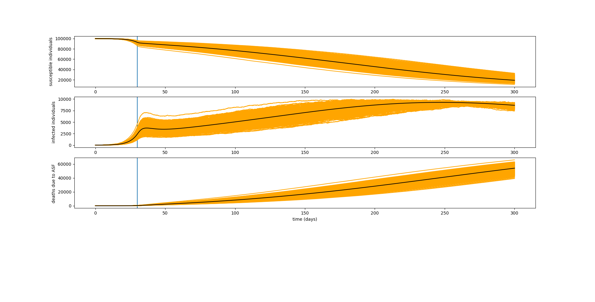
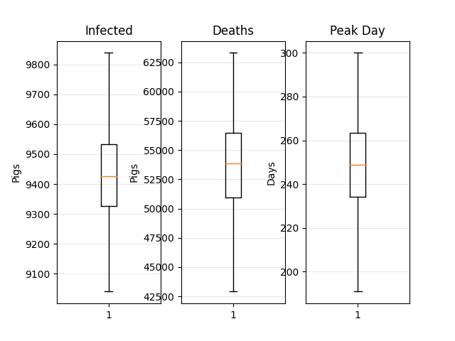

# ASFVModel
Numba accelerated and multiprocess simulation of propagation of the African Swine Fever Virus using Gillespie Algorithm [1] implemented in the same way as this [project](https://github.com/Gdemaude/Gillespie).

This model is a replication of the model explained in [2] with a few differences: 

- Correction of an error in the original paper: the transition rate for exposed pigs is Beta * S * (I + epsilon * C) / N  instead of Beta * S * (I + epsilon * C) , with N the total of live pigs.
- No modelling of a vaccination plan for ASFV, only biosecurity measures are taken into account.
- Emphasis on the speed of the implementation to be able to run the model on a larger population (tens of thousands of pigs instead of 500) within a reasonnable amount of time.

# Implementation
To run the model on a larger scale while maintaining a reasonnable runtime, a few keypoints were necessary. 

Firstly, Numba is used to accelerate the gillespie_direct() and the propensity() function. This step alone allows the model to run 10 times faster than a normal python implementation.

Secondly, in order to exploit a multicore processor, a multiprocessed approach was used. The workload was divided and fed to the available cores. The results is stored in shared memory for the main process to use in order to plot the graphs. Due to the overhead of creating processes, this approach is especially useful when a large number of simulations on a big population are computed. Indeed for 100 simulations on a population of 100000 pigs, the multiprocessed approach runs 2 times faster the the single process approach whereas 1000 simulations on the same population is 3 times faster with the multiprocessed approach. The CPU used was a quadcore i5.

The amount of data can become quite large and thus saturate the RAM available, thus the results are subsampled to feed matplotlib and create the graphs.

# Results

    

Results of the simulation on a population of 100000 pigs. Orange curves: stochastic simulations. Black curve: ODE resolution. Blue line: Day of implementation of bio-security measures. 

    

# References
[1] Exact stochastic simulation of coupled chemical reactions : https://pubs.acs.org/doi/abs/10.1021/j100540a008

[2] A Mathematical Model that Simulates Control Options for African Swine Fever Virus (ASFV) :  https://doi.org/10.1371/journal.pone.0158658
# Authors
Guillaume Demaude

Ninon Lavignasse
